<div align="center">

# 🛡️ ML Sentinel

### Autonomous ML Intelligence Platform

*Predict. Explain. Monitor. Govern. Retrain — with a human always in the loop.*


[✨ Overview](#-overview) · [🏗️ Architecture](#️-architecture) · [🗂️ Repo Layout](#️-repo-layout) · [🚀 Quickstart](#-quickstart) · [☁️ Deploy](#️-cloud-deployment) · [🔐 Governance](#-governance-model)

</div>

---

## ✨ Overview

A production-style ML platform for a **customer-churn** use case. It doesn't just predict — it:

| | Capability |
|---|---|
| 🧹 | Profiles **data quality** |
| 🏁 | **Benchmarks** 9 algorithms |
| ⚠️ | Scores **model risk** (0–100) |
| 📉 | Detects **drift** |
| 🔍 | **Explains** predictions (SHAP + counterfactuals) |
| ⚖️ | Checks **fairness** |
| 🔄 | Decides **when to retrain** |
| 🧑‍⚖️ | Keeps a **human in the loop** before anything reaches production |

---

## 🌍 Multi-Cloud Deployment Options

ML Sentinel ships production deployments for **AWS EC2** and **Microsoft Azure App Service**:

| Cloud | Folder | What you get |
|---|---|---|
| ☁️ **AWS EC2** | `ec2/` | Automated provisioning (`ec2/deploy.py`), Systemd services, Nginx reverse proxy, Docker Compose stack |
| 🔷 **Azure App Service** | `azure/` | Web App deploy scripts (`deploy_azure.py`, `deploy.sh`), Oryx startup handler (`startup.sh`), GitHub Actions workflow (`.github/workflows/azure_deployment.yml`) |

---

## 🏗️ Architecture

```mermaid
flowchart LR
    A[📓 Jupyter / EDA] --> B[🧹 Preprocessing]
    B --> C[🧬 Feature Engineering]
    C --> D[🏁 Model Benchmark<br/>9 algos]
    D --> E[🏆 Champion Model]
    E --> F[📈 MLflow Tracking]
    F --> G[🗃️ Model Registry]
    G --> H[⚠️ Risk Engine]
    H --> I[☁️ Cloud Deploy<br/>EC2 / Azure]
    I --> J[⚡ FastAPI]
    J --> K[📊 Streamlit Dashboard]
    K --> L[👀 Monitoring<br/>Drift + Risk]
    L --> M[🔄 Autonomous Retraining]
    M --> N[🧑‍⚖️ Human Approval]
    N --> I
```



<details>
<summary>📝 Plain-text version</summary>

```
Jupyter/EDA → Preprocessing → Feature Engineering → Model Benchmark (9 algos)
    → Champion Model → MLflow Tracking → Model Registry → Risk Engine
    → Cloud Deployment (AWS EC2 / Azure App Service) → FastAPI → Streamlit Dashboard
    → Monitoring (Drift + Risk) → Autonomous Retraining → Human Approval → Deploy
```

</details>

---

## 🗂️ Repo Layout

```
ml-sentinel/
├── 📦 data/                 synthetic churn dataset generator + generated CSVs
├── 🧠 ml/
│   ├── preprocessing/       data quality profiling + cleaning/encoding pipeline
│   ├── features/            feature engineering + selection (MI, RFE, correlation)
│   ├── models/              9-algorithm benchmark, registry, champion/challenger, retraining
│   ├── evaluation/          metrics + calibration
│   ├── explainability/      SHAP global/local importance + counterfactuals
│   ├── drift/               PSI, KS, Jensen-Shannon, Wasserstein, schema/quality drift
│   ├── risk/                0-100 risk engine + security (PII, schema validation, checksums)
│   └── fairness/            demographic parity, equal opportunity, equalized odds
├── ⚡ api/                  FastAPI service (prediction + governance endpoints, JWT/RBAC, rate limiting)
├── 📊 app/                  Streamlit dark command-center dashboard
├── ☁️ ec2/                  AWS EC2 deployment script, systemd units, Nginx config, Dockerfile
├── 🔷 azure/                Azure App Service deployment scripts, startup.sh, ARM config
├── 📓 notebooks/            Jupyter pipeline walkthrough notebook
├── 🛠️ scripts/              train_and_register.py — the one-command pipeline runner
├── ✅ tests/                pytest suite covering every core module
├── 🔑 configs/              IAM policies and Azure deployment role JSON
└── 🤖 .github/workflows/    CI, scheduled training, EC2 deployment, Azure deployment
```

---

## 🚀 Quickstart

```bash
pip install -r requirements.txt
```

**1️⃣ Generate the synthetic dataset** (`train_raw.csv` + `production_traffic.csv`)

```bash
PYTHONPATH=. python3 data/generate_data.py
```

**2️⃣ Run the full pipeline** — preprocess → benchmark 9 models → evaluate → risk/drift/fairness → register champion → write `artifacts/`

```bash
PYTHONPATH=. python3 scripts/train_and_register.py
```

**3️⃣ Serve predictions via FastAPI** ⚡

```bash
PYTHONPATH=. uvicorn api.main:app --reload --port 8000
# test: curl http://localhost:8000/governance/risk
```

**4️⃣ Launch the Streamlit dashboard** 📊

```bash
PYTHONPATH=. streamlit run app/streamlit_app.py
```

**5️⃣ Run tests** ✅

```bash
PYTHONPATH=. pytest tests/ -v
```

### 🔌 API Endpoints

| Method | Endpoint | Purpose |
|:---:|---|---|
| `GET` | `/health` | ❤️ Service + model status |
| `POST` | `/predict/single` | 🎯 One customer prediction |
| `POST` | `/predict/batch` | 📦 Up to 5000 rows |
| `POST` | `/predict/explain` | 🔍 Prediction + top factors + counterfactual |
| `GET` | `/governance/risk` | ⚠️ Risk score |
| `GET` | `/governance/drift` | 📉 Drift report |
| `GET` | `/governance/quality` | 🧹 Data quality report |
| `GET` | `/governance/leaderboard` | 🏁 Model benchmark |
| `GET` | `/governance/champion` | 🏆 Champion metrics |

---

## ☁️ Cloud Deployment

### 1️⃣ AWS EC2 ☁️

Deploy to a dedicated EC2 instance (Ubuntu 22.04 LTS):

```bash
python3 ec2/deploy.py \
    --key-name your-ec2-key-pair \
    --region us-east-1 \
    --instance-type m7i-flex.large
```

**What it provisions:**

- 🔓 EC2 instance with security group ports open (`22`, `80`, `443`, `8000`, `8501`)
- 🐍 Runs `ec2/setup_ec2.sh` to install Python 3.11, Nginx, and Systemd services (`ml-sentinel-api`, `ml-sentinel-app`)
- 🔀 Nginx reverse proxy: `/` → Streamlit (`8501`), `/api/` → FastAPI (`8000`)

### 2️⃣ Microsoft Azure App Service 🔷

Deploy to a Linux Web App:

```bash
# Option A: Python deploy script
python3 azure/deploy_azure.py \
    --resource-group ml-sentinel-rg \
    --app-name ml-sentinel-app \
    --location eastus

# Option B: Shell script via Azure CLI
./azure/deploy.sh ml-sentinel-rg ml-sentinel-app eastus
```

**What it provisions:**

- 🗄️ Azure Resource Group and Linux B1/P1v2 App Service Plan
- 🐍 Python 3.11 runtime stack, startup script set to `bash azure/startup.sh`
- 🌐 Deployment zip of the app and a live `.azurewebsites.net` web app

---

## 🔐 Governance Model

> 🧑‍⚖️ **No model reaches production without a human.**

- 🆕 Every retrain produces a **candidate**, never a champion, until it passes the promotion gate in `ml/models/registry.py::evaluate_promotion` (must meet or beat the current champion's F1 **and** stay under the risk threshold).
- 🚫 `ml/models/retraining.py` **never auto-promotes** — `requires_human_approval` is always `True` in its output.
- ✋ Cloud deployments enforce human-in-the-loop review before production candidate promotion.

---

<div align="center">

Built with 🐍 Python · ⚡ FastAPI · 📊 Streamlit · 🧠 scikit-learn · ☁️ AWS · 🔷 Azure

</div>
